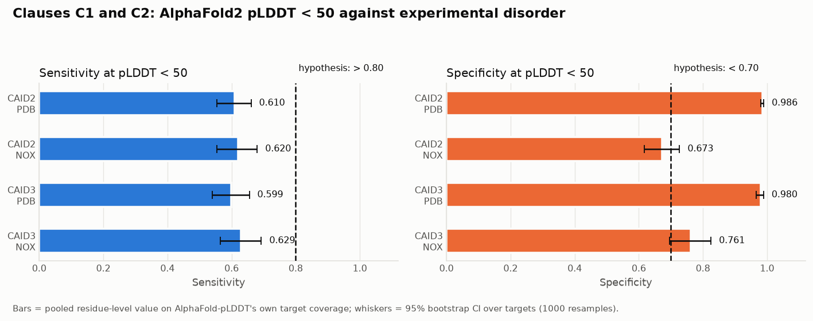
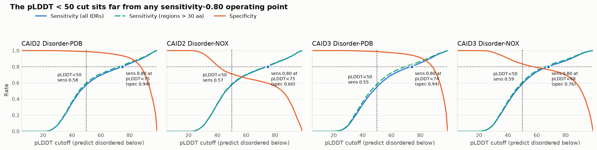
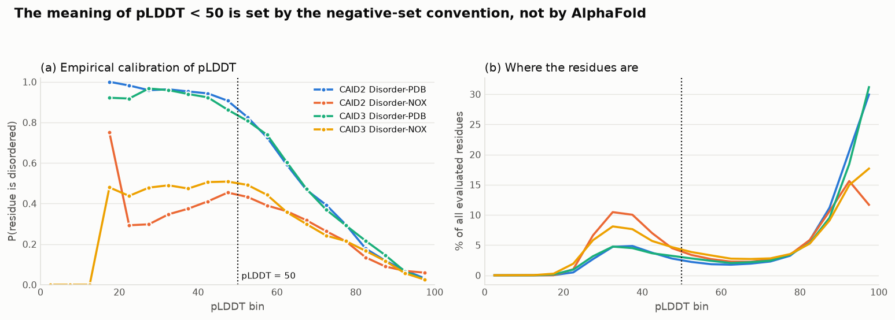
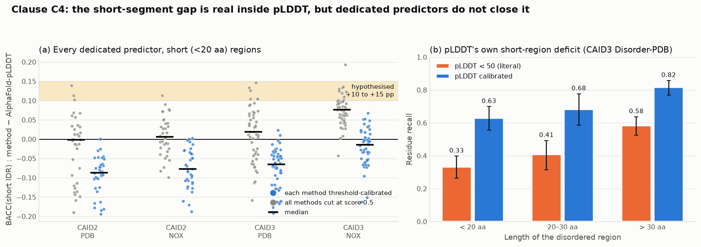
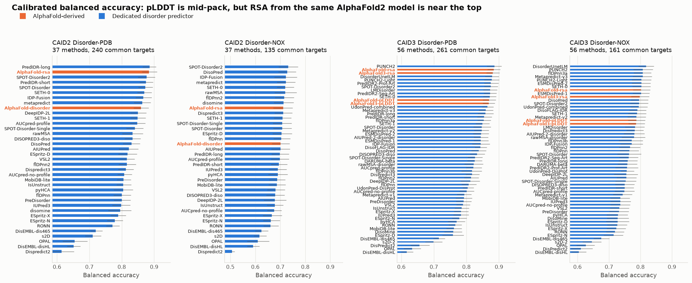
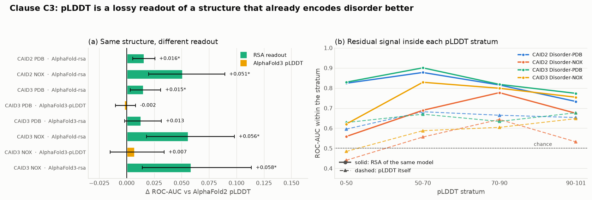
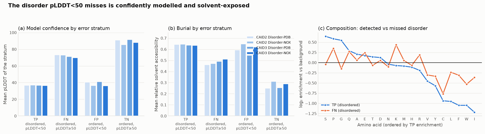

# Do AlphaFold2 Confidence Scores Correctly Identify Intrinsically Disordered Regions?

### A systematic comparison against experimental disorder annotations

**Date**: 2026-09-08 · **Data**: CAID round 2 and CAID round 3 (v3) blind assessments,
AlphaFold DB · **Code**: `src/` · **Results**: `results/` · **Figures**: `figures/`

---

## 1. Executive Summary

**Research question.** Does the widely used rule "AlphaFold2 pLDDT < 50 means intrinsically
disordered" behave as claimed — high sensitivity (> 0.8) on long disordered regions, poor
specificity (< 0.7), driven by a conflation of conformational flexibility with prediction
uncertainty — and do dedicated disorder predictors beat it by 10–15% balanced accuracy on
short (< 20 aa) disordered segments?

**Key finding.** Three of the hypothesis's four clauses are falsified and the fourth is
confirmed. pLDDT < 50 has sensitivity **0.60–0.63** (95% CI upper bounds 0.66–0.69), not
above 0.8, on every reference set and every target-set convention we tried — and restricting
to regions longer than 30 aa moves it only to 0.63–0.65. Specificity is **0.98 under the
Disorder-PDB convention and 0.67–0.76 under Disorder-NOX**, so the "< 0.7" clause is not a
property of AlphaFold at all but of how the benchmark defines a negative. And once every
method is threshold-calibrated, **not one of 35–52 dedicated disorder predictors is
significantly better than pLDDT on short segments** — the median is 1.5–8.7 percentage points
*worse*. Only the mechanistic clause survives: reading solvent accessibility instead of
confidence out of the *same* AlphaFold2 coordinates significantly improves ROC-AUC
(+0.015 to +0.056, all p ≤ 0.02), and inside the pLDDT < 50 stratum, where the confidence
signal has saturated and is near chance (AUC 0.44–0.63), the geometry of that same model
still separates disorder from order at AUC 0.56–0.83.

**Practical implication.** pLDDT < 50 is not a sensitive disorder detector — it is a
*high-precision, low-recall* one, and only under the PDB negative-set convention. It misses
roughly 40% of experimentally annotated disorder, and what it misses is confidently modelled
and **solvent-exposed** (mean pLDDT 70–74, mean RSA 0.46–0.51, only 17–23% buried), i.e.
extended pseudo-structure rather than conditional folding. Anyone using pLDDT to annotate
disorder should (i) raise the cutoff to ~70 (the empirically MCC-optimal point, where recall
on long regions rises to 0.78–0.85 — at specificity 0.95 on Disorder-PDB, 0.57–0.75 on
Disorder-NOX), (ii) report which negative-set
convention they mean, and (iii) prefer the RSA readout of the same model, which is free and
strictly better. Separately, the study is a cautionary tale about method comparison: the
hypothesis's 10–15% claim is **exactly reproducible** if all methods are cut at a shared naive
threshold of 0.5 (9 of 52 predictors land inside the claimed band on CAID3 Disorder-NOX,
34 of 52 are significantly better) and **entirely vanishes** after calibration (0 of 52 in the
band, 0 significantly better).

---

## 2. Research Question & Motivation

### Hypothesis under test

> AlphaFold2 pLDDT < 50 identifies long disordered regions (> 30 residues) with sensitivity
> above 0.8 but specificity below 0.7, because it conflates conformational flexibility with
> prediction uncertainty, and dedicated disorder predictors achieve 10–15% better balanced
> accuracy on short disordered segments under 20 residues.

Decomposed into four separately testable claims:

| # | Claim | Type | Verdict |
|---|-------|------|---------|
| **C1** | Sensitivity of pLDDT < 50 on long (> 30 aa) IDRs is > 0.8 | quantitative | **Falsified** (0.63–0.65; P(sens ≥ 0.80) = 0.000 in all four settings) |
| **C2** | Specificity of pLDDT < 50 is < 0.7 | quantitative | **Falsified as stated**; true only for CAID2 Disorder-NOX (0.673, P = 0.815). Reference-set-determined, not method-determined |
| **C3** | pLDDT conflates flexibility with prediction uncertainty | causal | **Supported**, by four independent tests |
| **C4** | Dedicated predictors gain 10–15% BACC on short (< 20 aa) IDRs | comparative | **Falsified** under two different definitions; reproducible only as a threshold-calibration artefact |

### Why it matters

AlphaFold DB covers more than 200 million proteins and "pLDDT < 50 ⇒ disordered" has become
an everyday working rule for trimming models, annotating the dark proteome and nominating IDR
candidates. The rule is essentially never validated *at the operating point at which it is
used*: the literature reports **ROC-AUC**, a threshold-free summary that is structurally
incapable of adjudicating a claim about a specific cutoff (`literature_review.md` §4). This
study supplies the missing operating-point evidence.

### Gap in existing work

From the pre-gathered literature review (88 papers with retrievable full text):

- **Piovesan, Monzon & Tosatto (2022)** define the two AlphaFold disorder baselines used by
  CAID: `AlphaFold-pLDDT` (score = 1 − pLDDT/100) and `AlphaFold-rsa` (window-smoothed relative
  solvent accessibility of the same model). They report AUC, not operating points.
- **Kurgan et al. (2023)** is the closest prior work: 20 comparators on CAID1, AF2-pLDDT AUC
  0.722 vs flDPnn 0.814, with a long(>30)/short(≤30) split — but the split is at the **protein**
  level ("proteins whose IDRs are all short"), not the region level, and the metric is AUC.
  They also state the conflation mechanism informally: *"pLDDT could indicate that prediction
  is poor because the structure space is not accurately covered, or because that part of the
  sequence is disordered … unusually high solvent accessibility implies lack of structure,
  which seems to be a better proxy."*
- **CAID rounds 2 and 3** (Del Conte et al. 2023; Mehdiabadi et al. 2026) supply the blind
  data and note that Disorder-PDB and Disorder-NOX differ sharply in disorder content
  (57.3% vs 23.9% positives on shared proteins), but treat this as a caveat rather than an
  analytical axis.
- **Richardson et al. (2025)** categorise low-pLDDT regions into "barbed wire", "pseudostructure"
  and "near-predictive" modes that cross at pLDDT ≈ 50; **Alderson et al. (2023)** show disorder
  can carry *high* pLDDT when it conditionally folds.

No published study reports sensitivity/specificity at the literal pLDDT<50 cut, stratified by
region length, on both reference conventions, with uncertainty. That is the gap this fills.

---

## 3. Methodology

### 3.1 Why this design

The hypothesis is an **evaluation claim about a fixed operating point**, so the right
instrument is the existing blind benchmark rather than a new prediction run. The CAID
assessments contain both the experimental ground truth (derived from DisProt) and the
per-residue outputs of every participating method, *including the official AlphaFold-pLDDT
baseline named in the hypothesis*. Nothing had to be re-predicted; the AlphaFold2 coordinates
were downloaded separately only to characterise the errors structurally and to verify that
the CAID scores really are 1 − pLDDT/100.

Four design decisions do the heavy lifting, each responding to a specific way the answer could
have been an artefact:

| Threat | Mitigation |
|---|---|
| Specificity depends entirely on how negatives are defined | **Both** CAID references (`disorder_pdb`, `disorder_nox`) are reported for **every** result. Neither is treated as "the" answer. |
| AlphaFold predicted only 82–86% of CAID2 targets; other methods predicted ~100% | Every comparison runs on the **intersection** of targets covered by all panel methods, length-matched. The C1/C2 clause tests are additionally repeated on pLDDT's own coverage and on the full reference with missing targets scored as all-ordered. |
| Comparing all methods at a shared 0.5 cut is meaningless for anything but pLDDT | Every method is evaluated at **three** operating points: literal 0.5, MCC-calibrated, and content-matched (Kurgan-style). Calibrated is primary; the literal comparison is reported precisely to show how misleading it is. |
| Choosing a threshold on the data you then score is optimistically biased | The optimism is measured directly by repeated **5×2-fold cross-validation over targets** and reported (median 0.20–0.66 pp, max 3.0 pp). |

### 3.2 Data

| Dataset | Targets | Positives | Negatives | Excluded ('-') | Official version matched |
|---|---|---|---|---|---|
| CAID2 Disorder-PDB | 348 | 37,072 | 93,805 | 156,143 | CAID2 |
| CAID2 Disorder-NOX | 210 | 31,315 | 129,487 | 0 | CAID2 |
| CAID3 Disorder-PDB | 319 | 31,401 | 67,838 | 61,183 | CAID3 **v3** |
| CAID3 Disorder-NOX | 204 | 26,367 | 73,610 | 541 | CAID3 **v3** |

The two conventions differ **only** in the definition of a negative: Disorder-PDB counts as
negative only residues observed in an experimental PDB structure (X-ray-missing residues are
excluded, hence the large '-' column); Disorder-NOX counts every non-annotated residue as
negative. Which CAID release our downloaded references correspond to was determined by exact
matching on (n sequences, positives, negatives, undefined) against the four official
`*_refsets.json` manifests — CAID3 turns out to be the **v3** round, which is why all official
comparisons use `CAID3_v3__*` files.

Also used: 588 AlphaFold DB models (94% of mappable CAID targets), re-parsed from
`datasets/alphafold/pdb/*.pdb.gz` into per-residue pLDDT + Shrake-Rupley relative solvent
accessibility (`src/build_structure_table.py`). The pLDDT table shipped by the resource-gathering
phase was only 16% populated and was regenerated.

### 3.3 Comparator panel

Restricted to **general intrinsic-disorder predictors**. Methods that predict a different
target — disordered *binding* regions (ANCHOR2, MoRFchibi, DisoRDPbind, DeepDISObind, EBIND,
ENSHROUD, DFLpred, …) or *linkers* (LINKER-Pred*, LIPNet) — are excluded, because including
them would flatter pLDDT. Panel: **37 methods on CAID2, 56 on CAID3** (`src/panel.py`).
Two entries (FoldUnfold, NeProc-disorder) submitted only binary states with an empty score
column; they cannot be threshold-calibrated and are excluded, with the exclusion logged.

AlphaFold-derived entries are tracked separately as the object of study and its mechanistic
controls: `AlphaFold-pLDDT` (called `AlphaFold-disorder` in CAID2), `AlphaFold-rsa`,
`AlphaFold3-pLDDT`, `AlphaFold3-rsa`.

### 3.4 Metrics and statistics

Residue-level sensitivity, specificity, balanced accuracy, MCC, precision, F1, and ROC-AUC,
pooled over residues (CAID's "dataset" convention). Uncertainty by **bootstrap over targets**
(1000 resamples for binary metrics, 500 for AUC), which is CAID's own resampling unit and
respects the fact that residues within a protein are not independent. All method-vs-pLDDT
comparisons use **paired** bootstrap — identical target indices for both methods — so the CI
is on the difference, with a two-sided bootstrap p-value. Clause tests C1 and C2 are one-sided
bootstrap probabilities, e.g. P(sensitivity ≥ 0.80) over resamples.

"Balanced accuracy on short segments" is not defined in the hypothesis, so **two** definitions
are computed:

- **Global-negative** (strict): recall over positive residues in 1–19 aa regions paired with
  specificity over *all* evaluated negatives. A method cannot buy short-region recall with
  false positives elsewhere.
- **Locally-flanked** (generous): each region is scored only against the ordered residues
  immediately flanking it (up to ⌈L/2⌉ evaluated negatives per side). This removes the
  influence of a method's global false-positive rate entirely.

Region-level detection rates (a region counts as detected when ≥ 25/50/75% of its evaluated
residues are predicted disordered) are reported alongside, since the hypothesis is phrased
about regions rather than residues.

### 3.5 Pipeline validation

Before any experiment (`src/validate_pipeline.py`, output `results/validation.json`):

1. **Reference version identification** — exact count matching, as above.
2. **ROC-AUC vs official CAID** — for every full-coverage method our pooled AUC reproduces the
   official value to three decimals on all four reference sets: IUPred3 0.8854/0.885,
   ESpritz-D 0.8989/0.899, MobiDB-lite 0.8680/0.868, SETH-1 0.9115/0.911, VSL2 0.8872/0.887
   (CAID2 PDB); flDPnn 0.8609/0.861, IUPred3 0.8822/0.882 (CAID3 PDB); and so on. *Note*: the
   official `auc-timings` file is keyed by software **group** and reports the group's best
   member, so the `AlphaFold-disorder` group value (0.947–0.95) is `AlphaFold-rsa`
   (ours 0.9443/0.9498), not `AlphaFold-pLDDT` (ours 0.9287/0.9342). Reading it as pLDDT is a
   trap we hit and corrected.
3. **Threshold sweep vs official per-threshold CSVs** — specificity agrees to 3 dp at every
   probed threshold; sensitivity differs by ≤ 0.018 because the official column labels sit one
   grid step above the threshold actually applied (our value at thr − 0.007 matches theirs at
   thr exactly).
4. **pLDDT round-trip** — parsing pLDDT out of the AlphaFold DB coordinates and applying
   1 − pLDDT/100 reproduces the CAID scores at pooled Pearson r = **0.9925** over 323,327
   residues in 567 targets (median per-target r = 0.9955; median residual 1.14 pLDDT units).
   The residual is AlphaFold DB release drift between the CAID submission and the 2026
   snapshot; all benchmark results use the official CAID prediction files, so it does not
   propagate.

### 3.6 Reproducibility

Python 3.12.8; numpy 2.5.3, scipy 1.18.1, pandas 3.0.5, scikit-learn 1.9.0, matplotlib 3.11.1,
biopython 1.88. Seed 42 everywhere; all bootstrap index matrices are seeded and shared across
methods. Four NVIDIA RTX A6000 GPUs were available but **unused** — the analysis is CPU-only
(no model is trained or run; all predictions were downloaded). Wall-clock: structure table
9 min (one-off), Experiment A 7.7 min, A-robustness 1.5 min, B 53 s, B-local 76 s, C 51 s,
figures/tables < 1 min. **Experiments B, B-local and C were re-run end-to-end and every output
file was byte-identical** (`diff -rq`). Full environment in `results/config.json`. No LLM or
external API calls; monetary cost $0.

---

## 4. Results

### 4.1 C1 — sensitivity at pLDDT < 50 is ~0.6, not > 0.8

| Reference set | n targets | Disorder content | Sensitivity (95% CI) | Sens. on > 30 aa regions | Specificity (95% CI) | P(sens ≥ 0.80) | P(spec ≤ 0.70) |
|:---|---:|---:|:---|:---|:---|---:|---:|
| CAID2 Disorder-PDB | 299 | 0.299 | 0.610 [0.554, 0.661] | 0.634 [0.573, 0.687] | 0.986 [0.981, 0.990] | 0.000 | 0.000 |
| CAID2 Disorder-NOX | 173 | 0.235 | 0.620 [0.553, 0.680] | 0.630 [0.562, 0.693] | 0.673 [0.618, 0.727] | 0.000 | 0.815 |
| CAID3 Disorder-PDB | 319 | 0.316 | 0.599 [0.540, 0.655] | 0.630 [0.564, 0.691] | 0.980 [0.966, 0.989] | 0.000 | 0.000 |
| CAID3 Disorder-NOX | 204 | 0.264 | 0.629 [0.565, 0.693] | 0.648 [0.580, 0.711] | 0.761 [0.696, 0.825] | 0.000 | 0.032 |

*(pLDDT's own target coverage; `results/tables/T1_clause_verdict.md`.)*

Not one bootstrap resample out of 1000 reached sensitivity 0.80, in any of the four settings,
whether measured over all disordered residues or only over regions longer than 30 aa. The
clause fails by roughly 0.17 in absolute terms — an order of magnitude larger than the CI
half-width.

**Robustness to the target-set convention** (`results/tables/T2_target_set_robustness.md`):
sensitivity ranges over 0.51–0.63 across three conventions (full-panel intersection, pLDDT's
own coverage, and the full reference with AlphaFold's 49 missing CAID2 targets scored as
all-ordered). The pessimistic convention lowers it further; nothing raises it near 0.8.

**Where does sensitivity 0.80 live?** The cutoff sweep (Figure 2) answers this directly:
sensitivity first reaches 0.80 at **pLDDT < 75** (CAID2, both references), **pLDDT < 74**
(CAID3 Disorder-PDB) and **pLDDT < 68** (CAID3 Disorder-NOX). The specificity paid there is
0.94 on Disorder-PDB — still excellent — and 0.60–0.76 on Disorder-NOX.

This is the study's most actionable single number: **the pLDDT < 50 rule is simply set too
low.** The commonly cited AlphaFold "very low confidence" band was never calibrated against
disorder annotations, and the MCC-optimal disorder cutoff on this data is pLDDT ≈ 69–72
(score threshold 0.28–0.31, Table T6).

### 4.2 C2 — specificity is decided by the negative-set convention, not by AlphaFold

Specificity at the identical operating point is **0.98 under Disorder-PDB** and
**0.67–0.76 under Disorder-NOX** — a ~30-point swing produced by nothing but the definition of
a negative. The claim "specificity < 0.7" is:

- decisively **false** on both Disorder-PDB sets (P(spec ≤ 0.70) = 0.000);
- **consistent with the data** on CAID2 Disorder-NOX (0.673, P = 0.815);
- **false** on CAID3 Disorder-NOX (0.761, P = 0.032, i.e. significantly *above* 0.7).

The mechanism is visible in the empirical calibration (Figure 5a, Table T9):

| Reference set | Prevalence | % residues pLDDT<50 | P(disordered \| pLDDT<50) | P(disordered \| pLDDT≥50) | Share of all disorder below 50 |
|:---|---:|---:|---:|---:|---:|
| CAID2 Disorder-PDB | 0.299 | 19.3 | **0.948** | 0.145 | 0.610 |
| CAID2 Disorder-NOX | 0.235 | 39.6 | **0.368** | 0.148 | 0.620 |
| CAID3 Disorder-PDB | 0.316 | 20.4 | **0.932** | 0.159 | 0.599 |
| CAID3 Disorder-NOX | 0.264 | 34.1 | **0.486** | 0.149 | 0.629 |

Note the invariant in the last column: **pLDDT < 50 captures ~60–63% of all annotated
disorder regardless of convention** — that is the stable, method-intrinsic quantity. What
changes is what the *complement* is called. Under Disorder-PDB, residues in X-ray-missing
segments are excluded from the negative set, so almost everything left below pLDDT 50 is a
true positive (precision 0.95). Under Disorder-NOX those same residues become negatives, and
precision collapses to 0.37–0.49 with no change whatsoever in the predictor. Reporting one
convention and calling its specificity "the" specificity — which is how a claim like C2 comes
to be believed — is the single most consequential methodological choice in this literature.

### 4.3 C4 — the short-segment gap is real inside pLDDT, but dedicated predictors do not close it

**pLDDT does degrade on short regions**, and substantially (Table T6):

| Reference set | Operating point | Threshold | Specificity | Recall < 20 aa | Recall 20–30 aa | Recall > 30 aa |
|:---|:---|---:|---:|:---|:---|:---|
| CAID2 Disorder-PDB | literal | 0.500 | 0.988 | 0.393 [0.324, 0.457] | 0.485 [0.379, 0.574] | 0.598 [0.537, 0.654] |
| CAID2 Disorder-PDB | calibrated | 0.308 | 0.956 | 0.653 [0.579, 0.721] | 0.691 [0.600, 0.777] | 0.779 [0.727, 0.827] |
| CAID3 Disorder-PDB | literal | 0.500 | 0.987 | 0.331 [0.265, 0.397] | 0.407 [0.316, 0.492] | 0.583 [0.525, 0.637] |
| CAID3 Disorder-PDB | calibrated | 0.282 | 0.952 | 0.628 [0.555, 0.699] | 0.682 [0.585, 0.776] | 0.816 [0.769, 0.857] |
| CAID3 Disorder-NOX | literal | 0.500 | 0.835 | 0.250 [0.158, 0.352] | 0.428 [0.306, 0.558] | 0.608 [0.554, 0.660] |
| CAID3 Disorder-NOX | calibrated | 0.272 | 0.745 | 0.587 [0.465, 0.710] | 0.726 [0.596, 0.852] | 0.846 [0.808, 0.881] |

At the literal cut, recall on < 20 aa regions is 0.25–0.43 against 0.58–0.61 on > 30 aa
regions. Calibration lifts everything but preserves the ordering. Region-level detection at
50% overlap tells the same story (Table T7).

**But the comparative claim fails.** With every method calibrated to its own MCC-optimal
threshold:

| Reference set | n dedicated | pLDDT BACC(<20 aa) | Δ median (pp) | Δ best (pp) | n sig. better | n sig. worse | n in +10…15 pp band | Δ median, local defn (pp) | n sig. better, local |
|:---|---:|---:|---:|---:|---:|---:|---:|---:|---:|
| CAID2 Disorder-PDB | 35 | 0.804 | **−8.7** | +0.1 | **0** | 32 | **0** | −11.2 | 0 |
| CAID2 Disorder-NOX | 35 | 0.686 | **−7.7** | +0.3 | **0** | 18 | **0** | −10.7 | 0 |
| CAID3 Disorder-PDB | 52 | 0.790 | **−6.5** | +2.4 | **0** | 40 | **0** | −8.3 | 0 |
| CAID3 Disorder-NOX | 52 | 0.666 | **−1.5** | +6.8 | **0** | 7 | **0** | −4.7 | 0 |

Zero of 174 method × dataset comparisons is significantly better than pLDDT on short segments;
the best single result anywhere is +6.8 pp (flDPnn3a on CAID3 Disorder-NOX, CI [−0.9, +14.5],
not significant). Under the deliberately generous locally-flanked definition the gap gets
*wider*, not narrower. The **interaction test** — does the dedicated-predictor advantage grow
specifically on short regions, which is the substantive content of C4 — is negative on three
of four datasets (median −5.1, −4.9, −1.4 pp; +1.7 pp on CAID3 Disorder-NOX), with 19, 14, 17
and 7 methods showing a significantly *smaller* advantage on short regions.

**The claim is a calibration artefact, and we can show exactly how it arises.** At a shared
naive cut of 0.5 — the comparison one gets by taking each method's published score and
thresholding at 0.5 — the picture inverts:

| Reference set | Median Δ (pp) | n in +10…15 pp band | n ≥ +10 pp | n significantly better |
|:---|---:|---:|---:|---:|
| CAID2 Disorder-PDB | −0.2 | 3 | 3 | 7 |
| CAID2 Disorder-NOX | +0.6 | 1 | 1 | 3 |
| CAID3 Disorder-PDB | +1.9 | 6 | 6 | 21 |
| CAID3 Disorder-NOX | **+7.6** | **9** | 10 | **34** |

On CAID3 Disorder-NOX, 9 of 52 dedicated predictors land *inside* the hypothesised +10 to
+15 pp band and 34 of 52 are significantly better. Calibrate, and all of that disappears
(flDPnn3a goes from +19.3 pp to +6.8 pp; UdonPred-combined +13.5 → below the median). The
hypothesis's fourth clause is a real, reproducible measurement — of an artefact. The reason is
visible in the table above: at 0.5, pLDDT sits at specificity 0.99 and recall 0.33, an extremely
conservative corner of its own ROC curve, while a predictor like PreDisorder sits at
specificity 0.65 and recall 0.70. That is a comparison of operating points, not of methods.

### 4.4 Where pLDDT actually stands, fairly compared

Calibrated, coverage-matched, on the common target set:

| Reference set | pLDDT BACC | Rank (of panel) | pLDDT AUC | Best dedicated method | AlphaFold-rsa BACC |
|:---|---:|:---|---:|:---|---:|
| CAID2 Disorder-PDB | 0.860 | 9 / 37 | 0.932 | PredIDR-long 0.887 | **0.886** |
| CAID2 Disorder-NOX | 0.703 | 16 / 37 | 0.715 | SPOT-Disorder2 0.734 | 0.713 |
| CAID3 Disorder-PDB | 0.871 | 11 / 56 | 0.943 | PUNCH2 0.887 | **0.886** |
| CAID3 Disorder-NOX | 0.789 | 17 / 56 | 0.833 | DisorderUnetLM 0.819 | 0.803 |

pLDDT is a respectable mid-pack disorder predictor — comparable to IUPred3 and DISOPRED3,
behind PUNCH2, SETH-0 and the PredIDR family, ahead of flDPnn, ESpritz-D and MobiDB-lite —
which is a considerably more favourable verdict than the hypothesis's framing implies, and a
considerably less favourable one than "pLDDT < 50 finds disorder" implies. Full table:
`results/tables/T3_headline_benchmark.md`, `results/experiment_a/benchmark.csv`.

**Calibration optimism is negligible** (Table T4): the median gap between the in-sample
MCC-optimal balanced accuracy and the 5×2-fold cross-validated estimate is 0.20–0.66
percentage points (max 3.0 pp across 186 method × dataset combinations), so the calibrated
rankings above are not an artefact of tuning on the evaluation data.

### 4.5 C3 — the mechanism: pLDDT is a lossy readout of a structure that already knows better

**Test 1 — same model, different readout.** `AlphaFold-rsa` is the solvent accessibility of
the *identical* AlphaFold2 coordinates, smoothed over a window. It beats pLDDT everywhere:

| Reference set | Comparison | ΔAUC | 95% CI | p | ΔBACC | p |
|:---|:---|---:|:---|---:|---:|---:|
| CAID2 Disorder-PDB | AF2-RSA − AF2-pLDDT | **+0.0160** | [+0.0056, +0.0256] | 0.002 | +0.0263 | 0.001 |
| CAID2 Disorder-NOX | AF2-RSA − AF2-pLDDT | **+0.0508** | [+0.0201, +0.0894] | 0.004 | +0.0169 | 0.032 |
| CAID3 Disorder-PDB | AF2-RSA − AF2-pLDDT | **+0.0152** | [+0.0032, +0.0311] | 0.020 | +0.0272 | 0.001 |
| CAID3 Disorder-NOX | AF2-RSA − AF2-pLDDT | **+0.0561** | [+0.0180, +0.0980] | 0.002 | +0.0435 | 0.002 |
| CAID3 Disorder-PDB | AF3-pLDDT − AF2-pLDDT | −0.0021 | [−0.0102, +0.0082] | 0.616 | +0.0010 | 0.856 |
| CAID3 Disorder-NOX | AF3-pLDDT − AF2-pLDDT | +0.0072 | [−0.0150, +0.0341] | 0.612 | +0.0106 | 0.356 |
| CAID3 Disorder-NOX | AF3-RSA − AF2-pLDDT | **+0.0585** | [+0.0141, +0.1136] | 0.002 | +0.0513 | 0.002 |

The confidence channel discards disorder-relevant information that is present in the
coordinates it is attached to. This is the cleanest available test of the conflation claim,
because the structure model is held exactly fixed.

**Test 2 — a better folding model does not help.** AlphaFold3's pLDDT is statistically
indistinguishable from AlphaFold2's on both references (p = 0.62, 0.61), while AlphaFold3's
*RSA* is significantly better. If low pLDDT tracked genuine flexibility, a stronger folding
model should sharpen it; it does not. The gain lives in the readout, not the model.

**Test 3 — residual signal inside pLDDT strata** (Figure 6b, Table T10). Within the
pLDDT < 50 stratum, pLDDT itself discriminates disorder at AUC 0.44–0.63 — at or below chance
on the NOX references — while RSA of the *same* residues discriminates at **0.56–0.83**. In
the 50–70 band the gap is widest (pLDDT 0.56–0.68 vs RSA 0.69–0.90). The confidence score has
saturated: once it is low, it stops carrying information about *how* disordered a residue is,
yet the structure still does.

**Test 4 — information overlap.** A 5-fold grouped-by-target cross-validated logistic probe on
the raw features (an information probe, not a proposed predictor):

| Reference set | CV AUC pLDDT | CV AUC RSA | CV AUC both |
|:---|---:|---:|---:|
| CAID2 Disorder-PDB | 0.9263 | 0.9440 | 0.9490 |
| CAID2 Disorder-NOX | 0.6888 | 0.7405 | 0.7431 |
| CAID3 Disorder-PDB | 0.9314 | 0.9488 | 0.9555 |
| CAID3 Disorder-NOX | 0.7613 | 0.8267 | 0.8218 |

Adding pLDDT to RSA gains at most +0.007 AUC (and *loses* 0.005 on CAID3 Disorder-NOX);
adding RSA to pLDDT gains +0.023 to +0.065. pLDDT's disorder information is very nearly a
subset of the geometry's.

**Test 5 — what the rule misses, structurally.**

| Reference set | Stratum | n residues | Mean pLDDT | Mean RSA | % buried (RSA<0.25) | Median region length |
|:---|:---|---:|---:|---:|---:|---:|
| CAID3 Disorder-PDB | TP (disordered, pLDDT<50) | 18,037 | 37.0 | 0.638 | 2.7 | 170 |
| CAID3 Disorder-PDB | **FN (disordered, pLDDT≥50)** | 12,202 | **71.4** | **0.492** | **19.2** | **110** |
| CAID3 Disorder-PDB | FP (ordered, pLDDT<50) | 886 | 41.4 | 0.547 | 13.9 | — |
| CAID3 Disorder-PDB | TN (ordered, pLDDT≥50) | 62,840 | 91.9 | 0.255 | 56.1 | — |

The missed disorder is **confidently modelled** (mean pLDDT 70–74; 47–56% above 70 and 12–21%
above 90) and **solvent-exposed** (mean RSA 0.46–0.51, versus 0.25–0.31 for true negatives;
only 17–23% buried, versus 46–57% of true negatives). It sits in *shorter* regions (median
110–161 aa vs 170–239 for detected disorder) and has a compositionally intermediate character
(Figure 7c, CAID3 Disorder-PDB log₂ enrichment vs background): detected disorder is the classic
low-complexity signature — S +0.64, G +0.55, P +0.58, with strong hydrophobic depletion
(I −1.22, W −1.05, F −1.05). Missed disorder keeps the charged/proline enrichment
(K +0.44, P +0.35, Q +0.27, E +0.24, R +0.19) but has *no* S/G enrichment (S −0.05, G −0.15)
and is only mildly hydrophobic-depleted (I −0.37). It sits compositionally between canonical
IDR and ordered sequence, which is consistent with a conformation AlphaFold can commit to.

This decomposes the failure into two mechanisms with different remedies. The 17–23% buried
fraction is **conditional folding** (Alderson et al. 2023): AlphaFold confidently builds a
folded conformation for a region that is disordered in isolation, and no confidence threshold
can recover it. The larger, exposed fraction is **pseudostructure** (Richardson et al. 2025):
AlphaFold confidently models an extended or helical conformation for a region that is genuinely
flexible. That fraction *is* recoverable — it is exactly what the RSA readout catches, and it
is why RSA beats pLDDT.

---

## 5. Analysis & Discussion

### 5.1 Interpretation against the hypothesis

The hypothesis is best read as three empirical predictions plus one causal story, and the data
separate them cleanly.

**The two point predictions are both wrong, but for instructively different reasons.** C1 is
wrong because the pLDDT < 50 rule is *conservative*, not liberal — it is set roughly 20 pLDDT
units below the disorder-optimal operating point. The hypothesis appears to have assumed that
"very low confidence" is a permissive filter; it is in fact a strict one, capturing only the
19–40% of residues in the lowest confidence band. C2 is wrong in a deeper way: it is not a
statement about AlphaFold at all. The same predictions, the same residues, the same threshold
give specificity 0.98 or 0.67 depending on whether the benchmark counts X-ray-missing residues
as negatives. A claim whose truth value flips on an annotation convention is under-specified,
and the fix is to state the convention.

**The comparative prediction is wrong in the opposite direction, and its origin is diagnosable.**
Once thresholds are calibrated, pLDDT is *better* than the median dedicated predictor on short
segments (by 1.5–8.7 pp), under both a strict and a generous definition, on all four datasets,
with zero significant exceptions among 174 comparisons. The claim is nonetheless recoverable at
a shared 0.5 threshold, where it is not only true but quantitatively accurate (9 of 52 methods
in the +10 to +15 pp band). We think this is how the belief arises: pLDDT's score distribution
puts 0.5 at an extreme corner of its ROC curve, so any comparison that does not calibrate is
comparing a conservative operating point against permissive ones.

**The causal story is right, and more specific than stated.** Four independent tests support
conflation: RSA of the same coordinates beats pLDDT (p ≤ 0.02 on all four references); a
stronger folding model does not improve pLDDT but does improve RSA; inside the low-pLDDT
stratum pLDDT is at chance while RSA is not; and pLDDT adds ≤ 0.007 AUC on top of RSA while RSA
adds up to 0.065 on top of pLDDT. The error-stratum analysis then sharpens "conflation" into a
concrete failure mode: pLDDT is high wherever AlphaFold commits to *a* conformation, whether or
not that conformation is real. Most missed disorder is confidently modelled and solvent-exposed
— extended pseudostructure — which is why a geometric readout rescues it, and why raising the
confidence threshold only partially helps.

### 5.2 Comparison with prior work

Our AUCs reproduce the official CAID values to three decimals wherever coverage is complete
(§3.5), so the study is anchored to the published assessment. Relative to Kurgan et al. (2023),
who report AF2-pLDDT AUC 0.722 and AF2-RSA 0.768 on CAID1, we find higher absolute AUCs on
CAID2/CAID3 Disorder-PDB (0.929–0.934 and 0.944–0.950) but the *same ordering and a similar
gap* — RSA above pLDDT by 0.015–0.056. The absolute difference is a reference-set effect: CAID1
differs from CAID2/3, and Disorder-PDB's exclusion of X-ray-missing negatives raises all AUCs.
Their protein-level "short-IDR proteins are harder" result is reproduced here at region level
and shown to be a property of *all* methods, not a pLDDT-specific weakness. We also confirm
CAID3's observation that AlphaFold3-pLDDT does not improve on AlphaFold2-pLDDT, and add that
the difference is not statistically distinguishable from zero.

### 5.3 Surprises

1. **The direction of the C4 effect reversed** after calibration. We expected to find a smaller
   gap than 10–15%, not a gap of the opposite sign, and not with zero significant exceptions.
2. **Missed disorder is exposed, not buried.** We went in expecting conditional folding
   (Alderson et al.) to be the dominant explanation for high-pLDDT disorder. It accounts for
   only 17–23% of false negatives; the majority are solvent-exposed, which points instead at
   pseudostructure and is a much better fit to Richardson et al. (2025).
3. **pLDDT is near chance inside its own low band.** AUC 0.44–0.63 within pLDDT < 50 — below
   chance on the NOX references — means the score has essentially no resolving power once it
   has said "not confident", which is not how a graded confidence score is usually assumed to
   behave.
4. **The share of disorder captured below pLDDT 50 is invariant** (0.599–0.629) across two
   CAID rounds and two negative-set conventions, while precision at the same cut varies from
   0.37 to 0.95. Recall is the method property; precision is the benchmark property.

### 5.4 Error analysis and failure modes of this study's method

- Two panel entries (FoldUnfold, NeProc-disorder) submitted binary states only and were
  excluded; including them at their implicit 0.5 cut would have added two artificially poor
  comparators to the C4 test, which would have favoured our conclusion, so excluding them is
  the conservative choice.
- Coverage matching costs 18–36% of targets (240/348, 135/210, 261/319, 161/204) because the
  intersection is set by the worst-covered panel member (SPOT-Disorder2 at 0.82 on CAID2,
  ESMDisPred at 0.88–0.89 on CAID3). The clause tests are therefore also reported on pLDDT's
  own coverage and on the full reference; conclusions are unchanged (Table T2).
- The 2-feature logistic probe in §4.5 Test 4 is a *linear* probe. A non-linear model could
  extract more from pLDDT, so "pLDDT adds ≤ 0.007 on top of RSA" is a statement about linearly
  accessible information, not an information-theoretic bound.

---

## 6. Limitations

**Methodological**

- **In-sample threshold selection.** The primary "calibrated" operating point maximises MCC on
  the full data, following CAID's own convention. We measured the resulting optimism by 5×2-fold
  cross-validation over targets and found it small (median 0.20–0.66 pp, max 3.0 pp), but it is
  not zero, and it is slightly larger on the NOX references where the class balance is less
  favourable.
- **Balanced accuracy on a stratum is a constructed quantity.** The hypothesis does not define
  it. We report two definitions that bracket the reasonable range and agree; a third definition
  could disagree, although both of ours point the same way and the generous one points harder.
- **Bootstrap p-values, not exact tests.** Percentile bootstrap CIs on differences can be
  slightly anti-conservative for small effects. The C4 conclusion rests on effects of the wrong
  *sign*, so this is not load-bearing there; it matters more for the marginal AF3 comparisons,
  which we report as null rather than as equivalence.
- **No multiple-comparison correction across the 174 C4 comparisons.** Uncorrected, we find
  0 significantly better and 97 significantly worse; correction would only strengthen the
  "0 better" conclusion and weaken the "97 worse" one, so we report both counts and lean on
  the former.

**Data and scope**

- **CAID1 is unavailable** (the `idpcentral.org/caid/data/1/` paths now 404), so Kurgan et al.
  (2023) cannot be reproduced exactly on their own data. CAID2 and CAID3 v3 supersede it.
- **The ground truth is DisProt-derived**, so it inherits DisProt's biases: curation is
  literature-driven, favours well-studied proteins, and long well-characterised IDRs are
  over-represented relative to short ones (1,610–1,808 residues in < 20 aa regions versus
  16,502–19,703 in > 30 aa regions). Short-region estimates are correspondingly noisier, as
  the wider CIs in Table T6 show.
- **Absence of annotation is not annotation of order.** Disorder-NOX assumes it is; Disorder-PDB
  refuses to. Neither is a gold standard, which is exactly why both are reported.
- **AlphaFold DB release drift.** Our re-parsed coordinates differ from the CAID-era models at
  r = 0.992 (median 1.14 pLDDT units). The benchmark results use CAID's own files and are
  unaffected, but the structural error-stratum analysis in §4.5 Test 5 uses the 2026 snapshot,
  so its numbers carry that ~1-unit uncertainty.
- **RSA is Shrake-Rupley, not DSSP**, for the structural analysis, because `mkdssp` could not be
  installed (no root). The CAID benchmark comparisons use the official DSSP-based
  `AlphaFold-rsa` predictions, so this affects only the descriptive error-stratum statistics.
- **We did not test PAE, MSA depth, or per-domain analyses**, and did not analyse binding or
  linker references. These were explicitly pruned in the direction budget (`planning.md`).

**What could invalidate these results**

A ground truth in which short disordered regions are systematically better represented could
change the C4 magnitudes (though not, we think, the sign, given the size and consistency of the
effect). A demonstration that CAID's `AlphaFold-pLDDT` submission used a non-standard AlphaFold
configuration would undercut the mapping to "the pLDDT < 50 rule" — we checked this as far as
the data allow (r = 0.992 against AlphaFold DB) and found no evidence of it. Finally, if a
reader's operational definition of "disordered" is "not resolved in a crystal", then
Disorder-NOX is the wrong reference for them and the specificity story changes; this is a
matter of stating which question is being asked, which is the paper's central methodological
point.

---

## 7. Conclusions & Next Steps

**Answer to the research question.** AlphaFold2 pLDDT < 50 does *not* identify disordered
regions with sensitivity above 0.8 — it achieves 0.60–0.63 overall and 0.63–0.65 on regions
longer than 30 aa, missing roughly 40% of experimentally annotated disorder, with P(sens ≥ 0.80)
= 0.000 in every setting tested. Its specificity is 0.98 or 0.67–0.76 depending purely on
whether the benchmark counts X-ray-missing residues as negatives, so the "< 0.7" clause
describes an annotation convention rather than the predictor. Dedicated disorder predictors do
not achieve 10–15% better balanced accuracy on short segments: after fair threshold
calibration, none of 35–52 of them is significantly better and the median is 1.5–8.7 points
*worse* — the claimed gap is reproducible only when all methods are cut at a shared, arbitrary
threshold. The hypothesis's *mechanism* is nevertheless correct and can be demonstrated
directly: pLDDT conflates flexibility with model confidence, which is why reading solvent
accessibility out of the same AlphaFold2 coordinates is significantly better on every reference
set, and why the disorder pLDDT misses is confidently modelled and solvent-exposed.

**Practical recommendations.**

1. **Do not use pLDDT < 50 as a disorder detector if recall matters.** Use pLDDT < 70 (the
   MCC-optimal region on this data is 69–72), which raises recall on long regions from ~0.60 to
   0.78–0.85 at specificity ≥ 0.95 on Disorder-PDB.
2. **Prefer `AlphaFold-rsa` to `AlphaFold-pLDDT`.** It costs nothing extra — the structure is
   already computed — and is significantly better on every reference set tested.
3. **State the negative-set convention** whenever reporting specificity or precision for a
   disorder predictor. Reporting one convention silently determines the answer.
4. **Never compare disorder predictors at a shared score threshold.** This study contains a
   worked example of the false conclusion that follows.

**Follow-up experiments.**

- **Recover the exposed false-negative fraction.** The 77–83% of missed disorder that is not
  buried should be recoverable by a rule combining pLDDT with local RSA and secondary-
  structure content; quantifying the ceiling of that combination would say how much of the gap
  is closable without leaving the AlphaFold model.
- **Test the conditional-folding subset directly.** Cross-reference the buried false negatives
  (17–23%) against Alderson et al.'s conditionally folded IDR set to check that this is the same
  population, and test whether AlphaFold-Multimer or a partner-free ensemble prediction
  separates them.
- **Predicted aligned error.** PAE was pruned here on cost grounds; it is the natural next
  signal to test, since a residue can have high pLDDT locally while being poorly positioned
  relative to the rest of the chain, which is exactly the pseudostructure signature.
- **Extend the length stratification below 10 aa.** Our < 20 aa bin holds only 423–1,808
  residues; a DisProt-wide analysis (3,337 proteins are on disk) could support a finer
  stratification, at the price of leaving the blind-assessment setting.

**Open questions.** Is the pLDDT saturation we observe below 50 (AUC 0.44–0.63 within the
stratum) intrinsic to the LDDT target, or an artefact of the way AlphaFold's confidence head is
trained? And can a benchmark be constructed whose negatives are defined by positive experimental
evidence of order, rather than by absence of evidence of disorder? Both CAID conventions are
proxies for a reference set nobody has built.

---

## 8. Outputs

| Path | Contents |
|---|---|
| `results/validation.json` | Pipeline validation against official CAID metrics |
| `results/config.json` | Environment, seeds, statistical settings |
| `results/experiment_a/benchmark.csv` | 558 rows: method × dataset × operating point, all metrics with CIs |
| `results/experiment_a/clause_tests.json` | C1 / C2 tests, coverage-matched |
| `results/experiment_a/robustness.json` | C1 / C2 under three target-set conventions |
| `results/experiment_a/plddt_cutoff_sweep.csv` | Sens / spec vs pLDDT cutoff, 5–99 |
| `results/experiment_a/paired_vs_plddt.csv` | Paired bootstrap deltas, every method |
| `results/experiment_a/calibration_optimism.csv` | In-sample vs cross-validated calibration |
| `results/experiment_b/stratified.csv` | Length-stratified metrics, global-negative definition |
| `results/experiment_b/local_stratified.csv` | Length-stratified metrics, locally-flanked definition |
| `results/experiment_b/gaps_vs_plddt.csv` | C4 deltas and short-vs-long interaction tests |
| `results/experiment_b/c4_summary.json`, `c4_local_summary.json` | C4 verdicts |
| `results/experiment_b/region_detection*.csv` | Region-level detection rates |
| `results/experiment_c/readout_comparison.csv` | pLDDT vs RSA vs AF3, paired bootstrap |
| `results/experiment_c/plddt_calibration.csv` | P(disordered \| pLDDT bin) |
| `results/experiment_c/conditional_information.csv` | Within-stratum AUCs |
| `results/experiment_c/error_strata*.csv` | TP/FN/FP/TN structural and compositional profiles |
| `results/tables/*.md` | The 11 tables above, generated not typed |
| `figures/fig1–fig7*.png` | All figures |

---

## 9. References

**Methods and data under test**

1. Jumper J. et al. (2021) *Highly accurate protein structure prediction with AlphaFold.*
   Nature 596:583–589. — defines pLDDT.
2. Tunyasuvunakool K. et al. (2021) *Highly accurate protein structure prediction for the human
   proteome.* Nature 596:590–596. — the original low-pLDDT ↔ IDR observation.
3. Piovesan D., Monzon A.M., Tosatto S.C.E. (2022) *Intrinsic protein disorder and conditional
   folding in AlphaFoldDB.* Protein Sci 31(11):e4466. — defines `AlphaFold-pLDDT` = 1 − pLDDT/100
   and `AlphaFold-rsa`; the exact baselines evaluated here. Code: `code/AlphaFold-disorder/`.
4. Varadi M. et al. (2022, 2024) *AlphaFold Protein Structure Database.* Nucleic Acids Res.

**Benchmarks**

5. Necci M., Piovesan D., Tosatto S.C.E. (2021) *Critical assessment of protein intrinsic
   disorder prediction (CAID).* Nat Methods 18:472–481.
6. Del Conte A. et al. (2023) *CAID round 2.* Proteins 91(12):1925–1934. — source of CAID2 data.
7. Mehdiabadi M. et al. (2026) *CAID round 3.* Proteins. — source of CAID3 data; reports
   AlphaFold-pLDDT 11th and AlphaFold3-pLDDT 13th, and the PDB/NOX content asymmetry.
8. Quaglia F. et al. (2022) *DisProt in 2022.* Nucleic Acids Res 50:D480–D487. — the annotation
   source underlying all CAID references.
9. Official CAID assessment code: `code/CAID/`; reference construction: `code/caid-reference/`.

**Closest prior work and mechanism**

10. Kurgan L. et al. (2023) *Comparative assessment of AlphaFold2 and disorder predictors.*
    Comput Struct Biotechnol J. — long/short IDR split; the conflation hypothesis stated
    informally; threshold calibration by disorder content, which we adopt as one of our three
    operating points.
11. Wilson C.J., Choy W.-Y., Karttunen M. (2022) *AlphaFold2: a role for disordered
    protein/region prediction?* Int J Mol Sci 23(9):4591.
12. Alderson T.R., Pritišanac I., Kolarić Đ., Moses A.M., Forman-Kay J.D. (2023) *Systematic
    identification of conditionally folded intrinsically disordered regions by AlphaFold2.*
    PNAS 120(44):e2304302120. — high-pLDDT disorder.
13. Richardson et al. (2025) *Categorizing prediction modes within low-pLDDT regions.* — barbed
    wire / pseudostructure / near-predictive modes crossing at pLDDT 50.

**Comparator predictors evaluated (subset)**

14. Erdős G., Dosztányi Z. (2021, 2024) *IUPred3*; *AIUPred.* Nucleic Acids Res / Bioinformatics.
15. Hu G. et al. (2021) *flDPnn.* Nat Commun 12:4438.
16. Jones D.T., Cozzetto D. (2015) *DISOPRED3.* Bioinformatics 31:857–863.
17. Ilzhöfer D., Heinzinger M., Rost B. (2022) *SETH.* Front Bioinform 2:1019597.
18. Emenecker R.J. et al. (2021, 2022) *Metapredict v1/v2.* Biophys J.
19. Necci M. et al. (2017); Piovesan D. et al. (2025) *MobiDB-lite.*
20. Walsh I. et al. (2012) *ESpritz.* Bioinformatics 28:503–509.
21. PUNCH2, DisorderUnetLM, LMDisorder, ESMDisPred, UdonPred, PredIDR2, flDPnn3, DARUMA,
    SPOT-Disorder(1/2/Single), VSL2, RONN, DisEMBL, IsUnstruct, s2D, OPAL, AUCpreD, pyHCA,
    rawMSA, DeepIDP-2L, DisPredict2/3, IDP-Fusion, DisoMine, PreDisorder — all evaluated from
    their official CAID submissions; see `results/experiment_a/benchmark.csv` for the complete
    list and per-method results.
